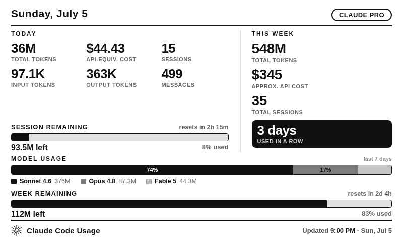

# TRMNL — Claude Code Usage

A grayscale ePaper plugin for [TRMNL](https://usetrmnl.com) that shows your
Claude Code usage at a glance: today, this week, API‑equivalent cost, and a
per‑model breakdown. A small Node server reads Claude Code's local transcript
logs, aggregates them, and serves an 800×480 screen. Every fetch recomputes
from the logs, so the screen is current each time TRMNL polls (every ~15 min).



## What it shows

- **Remaining gauges** — usage left in the current **session** (Claude's rolling
  5‑hour window, with a live reset countdown) and this **week**. See
  [Usage limits & "remaining"](#usage-limits--remaining) for how the baseline
  works.
- **Today** — total tokens, API‑equivalent cost, sessions, input tokens, output
  tokens, and messages.
- **This week** (rolling 7 days) — total tokens, approximate API cost, total
  sessions, and days used in a row (streak).
- **Model usage** — a segmented bar + legend showing each model's share of the
  week's tokens.
- **Plan badge** (top‑right) and a footer with the Claude mark, "Claude Code
  Usage", and the last‑updated time.

## How the data is produced

Claude Code writes a JSONL transcript per session under `~/.claude/projects/`.
Each assistant message carries a `usage` block (input / output / cache‑read /
cache‑creation tokens) and a `model`. The server:

- sums tokens per day, per model;
- counts distinct `sessionId`s as **sessions** and assistant replies as
  **messages**;
- computes **API‑equivalent cost** from published per‑model rates
  (`src/pricing.js`), including cache multipliers (read 0.10×, 5‑minute write
  1.25×, 1‑hour write 2×);
- de‑duplicates retries by `requestId + message.id`.

Cost is what the same tokens *would* cost on the pay‑as‑you‑go API — a useful
reference even on a subscription plan. It is not a bill.

## Usage limits & "remaining"

Claude meters usage in a rolling **5‑hour session window** and a weekly window,
but the exact plan token allowances are **not** present in the local logs, so
this plugin can't show an official "% of plan limit". Instead:

- **Session** — the active 5‑hour block (usage in it + a real countdown to when
  it resets). The 5‑hour block is computed directly from the logs. Its gauge
  lives in the **Today** box, under the input/output tiles.
- **Week** — usage since your weekly reset. Set `WEEK_RESET` (e.g. `Tue 9am`, in
  your local time) to anchor the window and get a real reset countdown;
  otherwise it's a rolling 7 days. Its gauge sits **below the model‑usage bar**.

Each gauge's "remaining" is measured against a limit you can configure:

- Set `SESSION_LIMIT` / `WEEK_LIMIT` (tokens, `k`/`m`/`b` suffixes) → the gauge
  shows true remaining and **"% used"**.
- Leave them unset → the baseline is your **busiest session / week so far**, and
  the gauge reads **"% of peak"** (or "at your peak" on a record period), so it's
  never mistaken for an official quota.

**Calibrating to match the Claude app.** The exact plan limits aren't in the
logs, so the shipped `SESSION_LIMIT` / `WEEK_LIMIT` are *calibrated*: they were
set so the gauges read ~33% session / ~83% week at setup time, matching what the
Claude app showed. The metering here is token‑based and won't track Claude's
official (model‑weighted) accounting exactly — treat it as a close proxy and
nudge the two env values until it lines up with your app.

> `TZ` must be **your** timezone — it drives both the display and the weekly
> reset anchor, and they have to agree.

## Headless by design

The server is a plain Node HTTP daemon — no browser, display, or GUI is needed
on the host. TRMNL renders the screen remotely; this app only produces
HTML/JSON. Run it under systemd (below) on any headless Linux box. (The optional
`npm run preview` just writes an HTML file; it launches nothing.)

## Requirements

- Node.js 18+ (zero npm dependencies).
- Read access to the Claude Code logs directory (`~/.claude/projects` by
  default). If TRMNL's fetch reaches a different machine than the one running
  Claude Code, sync that directory over and set `CLAUDE_PROJECTS_DIR`.

## Where does this run? (does it need my main PC?)

It needs to **read the Claude Code logs** — the JSONL files under
`~/.claude/projects` on whatever machine you actually use Claude Code on. It does
**not** need a GUI or your PC's screen; it's a headless HTTP daemon. Three ways to
run it:

1. **On the same machine you use Claude Code on** — simplest. It reads the local
   logs. That machine just has to be on and reachable when TRMNL fetches
   (every ~15 min).
2. **On an always‑on box** (home server, Pi, VPS) with the logs **synced** there
   (Syncthing / rsync / a shared mount), pointing `CLAUDE_PROJECTS_DIR` at the
   copy. Good if your PC sleeps.
3. **Push the logs** from your PC to the box with the built‑in ingest server +
   pusher (below) — no third‑party sync tool required.

TRMNL then fetches the screen from wherever it runs; the device itself does the
rendering.

## Pushing logs to an always‑on box (secret‑authenticated)

Instead of a sync tool, this repo ships a small **ingest server** (runs on the
box) and a **pusher worker** (runs on your Claude Code machine). The pusher
scans `~/.claude/projects`, gzip‑compresses each changed transcript, and POSTs it
to the ingest server with a shared secret; the ingest server mirrors the files
into a directory the display server reads.

```
[ your PC ]                         [ always-on box ]
 pusher  ──POST /push (x-api-key)──▶  ingest server ──writes──▶ INGEST_DIR
 (npm run push)                       (npm run ingest)                 │
                                      display server reads ◀───────────┘
                                      (CLAUDE_PROJECTS_DIR = INGEST_DIR)
```

**1. Make a shared secret:**

```bash
openssl rand -hex 32
```

**2. On the box — ingest server + display server:**

```bash
INGEST_SECRET=<secret> INGEST_DIR=~/.claude-usage/received npm run ingest   # :2524
CLAUDE_PROJECTS_DIR=~/.claude-usage/received npm start                       # :2523
```

**3. On your PC — the pusher:**

```bash
INGEST_URL=https://your-box.example:2524 INGEST_SECRET=<secret> npm run push
```

The pusher runs continuously (scan every `PUSH_INTERVAL` seconds, default 120);
add `--once` for a single push (cron / systemd timer). It only re‑sends files
whose size/mtime changed, tracked in `~/.claude-usage/push-state.json`.

Ingest endpoints: `POST /push` (headers `x-api-key`, `x-rel-path`; gzip body)
and `GET /health`. Bad key → 401; path traversal / non‑`.jsonl` → 400.

**Security:** run the ingest server behind TLS (a reverse proxy, or a tunnel like
`cloudflared`) so the secret and logs aren't sent in the clear. The secret is
compared in constant time, paths are confined to `INGEST_DIR`, and only `.jsonl`
files are accepted. Systemd units for both sides are in `deploy/`.

## Run it

```bash
node src/server.js
# or: npm start
```

Then open <http://localhost:2523/>. Endpoints:

| Path         | Purpose                                             |
|--------------|-----------------------------------------------------|
| `/`          | The rendered 800×480 screen (HTML).                 |
| `/data.json` | Raw aggregates **plus** a `display` block of pre‑formatted strings for the TRMNL Liquid template. |
| `/health`    | `ok` — for uptime checks.                           |

Preview without the server (writes `preview.html`, falls back to sample data if
no logs are found):

```bash
npm run preview && open preview.html
```

## Configuration

All optional — see `.env.example`.

| Variable              | Default                 | Meaning                                  |
|-----------------------|-------------------------|------------------------------------------|
| `PORT`                | `2523`                  | Listen port.                             |
| `HOST`                | `0.0.0.0`               | Listen interface.                        |
| `CLAUDE_PROJECTS_DIR` | `~/.claude/projects`    | Where to read transcript logs.           |
| `CLAUDE_PLAN`         | `Claude Max`            | Text shown in the plan badge.            |
| `TZ`                  | `America/Los_Angeles`   | Timezone for day/week/updated math.      |
| `WEEK_RESET`          | *(unset → rolling 7d)*  | Weekly reset anchor in local time, e.g. `Tue 9am`. |
| `SESSION_LIMIT`       | *(unset)*               | Session token allowance for the gauge (e.g. `102m`). |
| `WEEK_LIMIT`          | *(unset)*               | Weekly token allowance for the gauge (e.g. `660m`). |

## Connect it to TRMNL

The server must be reachable from TRMNL's fetchers (a public URL, tunnel such as
`cloudflared`/`ngrok`, or your own TRMNL BYOS server on the LAN).

### Option A — Native private plugin (recommended)

1. TRMNL dashboard → **Plugins → Private Plugin → Add New**.
2. Strategy: **Polling**. Polling URL: `https://your-host/data.json`.
3. Open the **Markup** editor and paste the contents of
   [`trmnl/markup.liquid`](trmnl/markup.liquid) into the shared/Full view.
4. Save, add the plugin to a playlist, and let the device refresh.

All number formatting is precomputed in `/data.json`'s `display` object, so the
template just interpolates strings — no Liquid math to maintain.

### Option B — Render our HTML directly

If you use a setup that screenshots a URL (e.g. a TRMNL BYOS server or a
"screenshot" plugin), point it straight at `https://your-host/`. The page is
already sized 800×480 and self‑contained (inline CSS + SVG, no external assets).

## Deploy as a service (systemd)

### Server (ingest + display) — one script

On the always-on box, from the repo, run the installer with your shared secret.
Run it **with `bash`** (not `sh`/`zsh`/`fish`) and as your normal user (it calls
`sudo` itself):

```bash
INGEST_SECRET=<the-shared-secret> bash deploy/install-server.sh
```

It writes `/etc/trmnl-claude/env` (root-only, holds the secret) plus
`trmnl-claude-ingest` (`:2524`) and `trmnl-claude-usage` (`:2523`) units, then
enables and starts both and health-checks them. Override any setting by
exporting it first, e.g. `TZ=America/Chicago CLAUDE_PLAN="Claude Max"
INGEST_SECRET=… bash deploy/install-server.sh`. Manage with
`sudo systemctl status trmnl-claude-usage` / `journalctl -u trmnl-claude-usage -e`.

> Display-only (no push / logs synced another way)? Skip the ingest service and
> just run `trmnl-claude-usage` with `CLAUDE_PROJECTS_DIR` pointed at the logs —
> see [`deploy/trmnl-claude-usage.service`](deploy/trmnl-claude-usage.service).

### PC (pusher) — user service, no sudo

On the machine you use Claude Code on:

```bash
mkdir -p ~/.config/trmnl-claude ~/.config/systemd/user
cp deploy/trmnl-claude-pusher.service ~/.config/systemd/user/   # or the user-unit variant
# put INGEST_URL + INGEST_SECRET in ~/.config/trmnl-claude/pusher.env (chmod 600)
systemctl --user daemon-reload
systemctl --user enable --now trmnl-claude-pusher
sudo loginctl enable-linger "$USER"   # optional: keep pushing while logged out
```

Follow it with `journalctl --user -u trmnl-claude-pusher -f`.

## Notes & limits

- "Sessions" = distinct Claude Code conversation IDs active in the period.
  "Messages" = assistant replies (the turns that incur cost).
- The week view is a **rolling** 7 days ending today; the streak counts
  consecutive active days ending today (or yesterday if today is still empty).
- Unknown/older model IDs fall back to Opus rates so cost is never undercounted.
- Grayscale by design: pure black/white plus a few grays that dither cleanly on
  e‑ink.

## Project layout

```
src/pricing.js   per-model rates + cost calculation
src/usage.js     read + aggregate transcripts; 5h session blocks; weekly peak
src/gauge.js     used/limit -> remaining gauge (configured limit or peak)
src/format.js    compact number / date / duration formatting
src/view.js      pre-formatted "display" model (HTML + Liquid share it)
src/render.js    the 800×480 HTML screen
src/server.js    display HTTP server (/, /data.json, /health)
src/ingest.js    log-ingest server (receives pushed logs, secret-authed)
src/pusher.js    pusher worker (pushes logs to the ingest server)
src/safepath.js  path sanitization for the ingest server
trmnl/markup.liquid   TRMNL Polling template
scripts/preview.js    render to a file for local viewing
test/check.js         dependency-free self-check (npm test)
deploy/*.service      systemd units (display / ingest / pusher)
```
